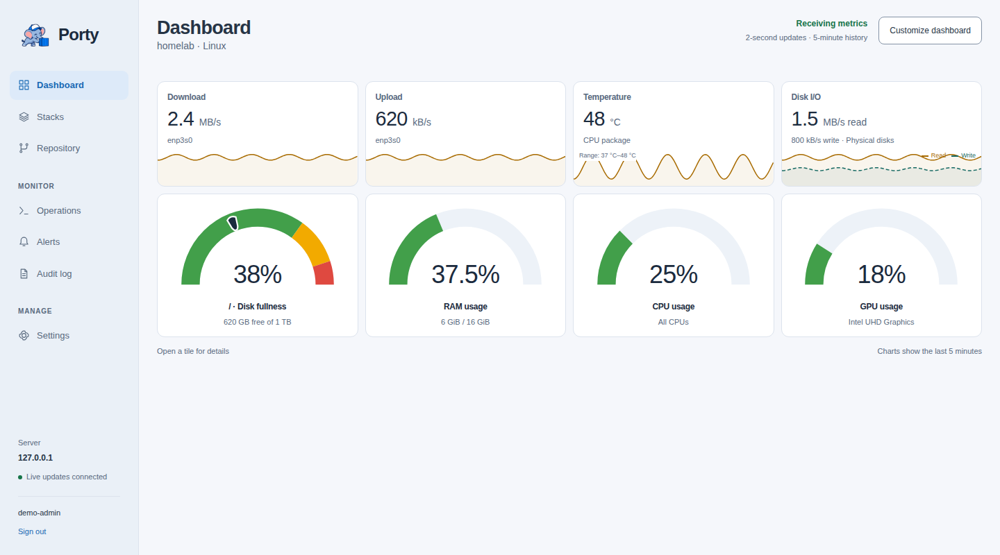

# Porty

Porty is a Docker Compose and Git manager for your Linux server. Manage stacks, edit configuration, deploy changes, and watch your host from one web interface.

**[Documentation](docs/README.md) · [Get started](docs/getting-started.md) · [Feature overview](docs/features.md)**

_The current Porty interface with demonstration metrics._

- **Manage Compose stacks:** review deployments, inspect containers, restart or stop workloads, and follow live logs.
- **Keep configuration in Git:** edit files, review diffs, commit stack changes, and synchronize with a remote repository.
- **Monitor your server:** view host resource usage, recent metric history, and filesystem fullness.
- **Automate routine operations:** schedule eligible image updates and configure on-demand container groups.
- **Investigate failures:** follow operation output, review alerts, and inspect audit history.

Porty targets Linux and one repository on one configured branch. Compose stacks are immediate, visible child directories containing exactly `docker-compose.yml`.

Start with the [first-stack walkthrough](docs/getting-started.md), then use the [user guide](docs/user-guide.md) for everyday tasks. See the [operator guide](docs/operator-guide.md) for installation, backup, upgrade, and OCI usage; [security model](docs/security.md) for trust boundaries; and [development guide](docs/development.md) for contributing.
