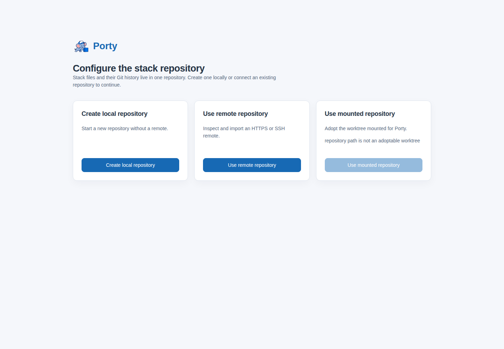
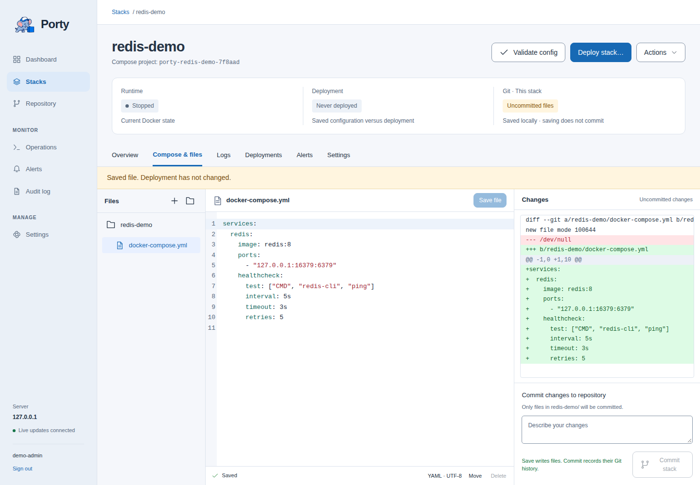
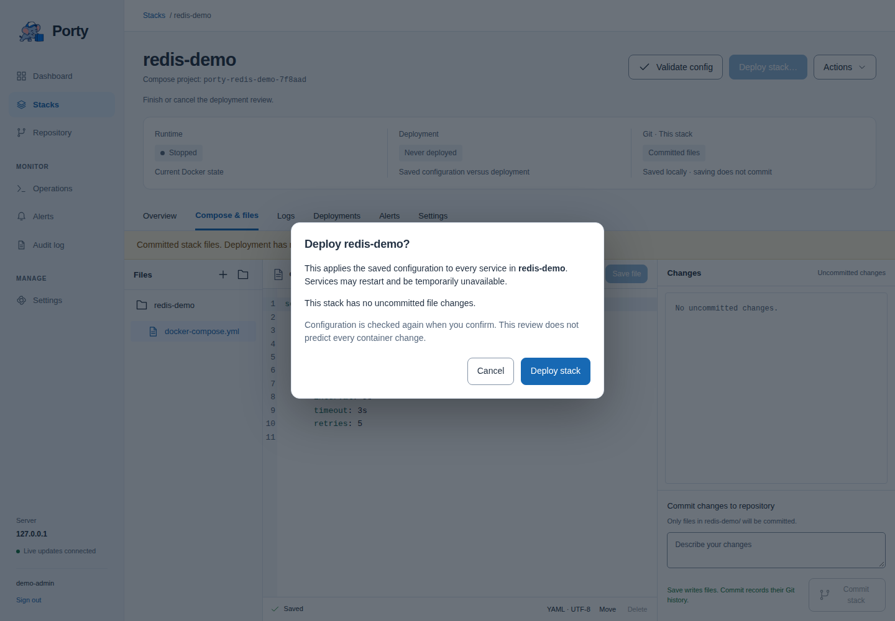
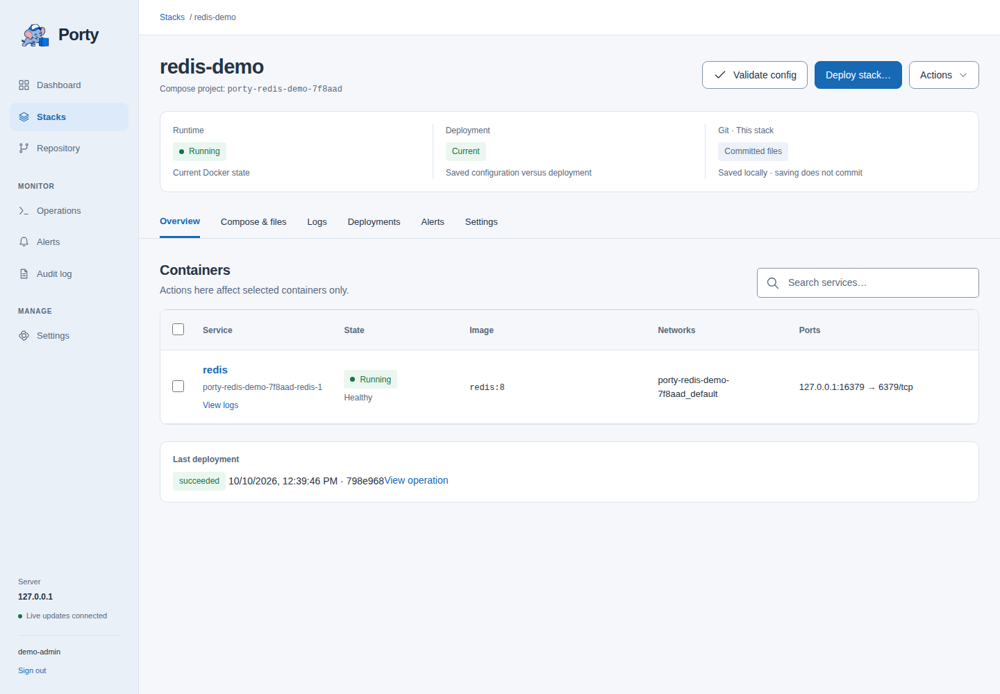

# Get started with Porty

[Documentation home](README.md)

This walkthrough installs Porty, creates a local configuration repository, and deploys a small Redis stack. You need a Linux Docker host and administrator access to install Porty. Use an unused port `16379` for the example, or choose another host port.

## 1. Install and open Porty

Choose one path in the operator guide:

- [Host installation](operator-guide.md#host-installation): build a binary and run it as a systemd service.
- [OCI image](operator-guide.md#oci-image): build an image and run it with persistent storage and Docker socket access.

Both paths serve the UI at `http://127.0.0.1:8080`. Open that address on the server. If your browser is on another machine, a private SSH tunnel lets you keep the default loopback listener:

```sh
ssh -N -L 8080:127.0.0.1:8080 your-user@your-server
```

Open `http://127.0.0.1:8080` on your own machine while the tunnel is running. For a permanent HTTPS address, configure a TLS proxy and [the public origin](operator-guide.md#browser-authentication-and-tls-proxies).

## 2. Create the administrator

On **Set up Porty**, enter a username and a password of at least 12 characters, then select **Create administrator**. Porty has one administrator account. Keep initial access private until registration is complete.

## 3. Configure the repository



For this walkthrough, select **Create local repository**, keep or change the initial branch and Git author, then select **Create repository**. No GitHub token or remote is required.

The other choices are **Use remote repository** and **Use mounted repository**. Their authentication, branch selection, and filesystem requirements are described in [Repository setup](operator-guide.md#repository-setup). You can add a managed remote later in **Settings → Repository remote**.

Porty stores the worktree at `<data-dir>/repository`. Stack management becomes available after setup; the Dashboard is available after sign-in even before setup is complete.

## 4. Create and save a stack

Open **Stacks → New stack**, enter `redis-demo`, and select **Create stack**. Open **Compose & files**, select `docker-compose.yml`, and replace its contents with:

```yaml
services:
  redis:
    image: redis:8
    ports:
      - "127.0.0.1:16379:6379"
    healthcheck:
      test: ["CMD", "redis-cli", "ping"]
      interval: 5s
      timeout: 3s
      retries: 5
```

Select **Save file**. The resulting file is `repository/redis-demo/docker-compose.yml` beneath Porty's data directory.



This disposable Redis example is bound to server loopback, has no authentication, and has no named volume or backup policy. The Redis image may create an anonymous Docker volume. Use it to learn the workflow, not to store important data. The image may be downloaded on first deployment.

## 5. Commit and deploy

1. In **Compose & files**, enter `Add Redis demo stack` as the commit message and select **Commit stack**. This records Git history locally.
2. Select **Validate config** and check that its operation succeeds.
3. Select **Deploy stack…** (or **Deploy changes…** if shown). Read the review and select **Deploy stack** to confirm.
4. Follow the operation until it succeeds. Close the operation panel and open **Overview**.



Saving writes files; committing records history; deploying applies saved configuration to Docker. A deployment can use uncommitted saved files and never creates a Git commit for you. If configuration changes after review, review it again before retrying.

## 6. Verify the result

The stack should show **Running**, with a Redis container that becomes **Healthy** after its healthcheck. Open **Logs** to look for Redis's readiness message, or open the container to inspect its state, ports, and logs.



If deployment fails, open its operation output and follow [deployment troubleshooting](troubleshooting.md#deployment-fails). The [user guide](user-guide.md) explains routine edits, redeployment, container controls, and Git synchronization.

## 7. Clean up the example

Use **Actions → Stop** to stop the stack while retaining its files. To remove it, open the stack's **Settings → Delete stack** and read the confirmation. Deletion brings the Compose project down, removes the stack directory, and archives its metadata. Docker volumes are retained; removing stack files can still destroy application data stored inside that directory. Git deletion changes are not automatically committed or pushed.

If deletion leaves you on **Stack not found**, select **Back to stacks** to return to the inventory.

These screenshots use a disposable installation. The dashboard image elsewhere in the documentation uses demonstration metrics rather than a hardware compatibility claim.
