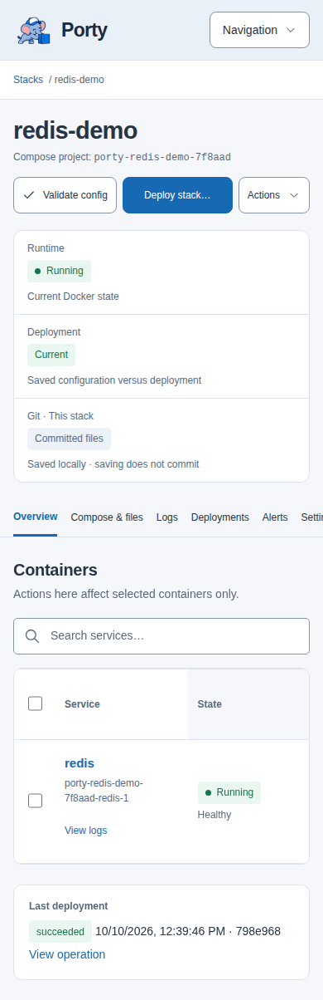

# Using Porty

[Documentation home](README.md) · [First-stack walkthrough](getting-started.md)

## Dashboard

Open **Dashboard** for CPU, RAM, temperature, GPU, network rates, disk I/O, and filesystem fullness. Select a metric's details to inspect its device and availability information. **Customize dashboard** selects available devices and filesystems; preferences are stored in your browser.

_Demonstration metrics in the current interface._

Samples are collected every two seconds and retained in memory for five minutes. A restart clears history. Network and disk rates use decimal B/s; memory uses binary units. Disk I/O measures activity, while disk fullness measures used filesystem capacity.

Unavailable or stale readings are not zero usage. Open details and check the [monitoring prerequisites](operator-guide.md#host-monitoring) before changing permissions. Supported metrics vary by driver and environment; Docker Desktop reports its Linux VM rather than your Windows or macOS host.

## Stacks

Open **Stacks** to search and filter the inventory. Runtime, deployment freshness, and Git state answer different questions: whether containers are running, whether saved configuration matches the deployment, and whether files have been committed.

Use **New stack** to create a named directory and its Compose file. Porty also discovers immediate, visible repository child directories containing exactly `docker-compose.yml`. See [the layout](features.md#terms-used-in-the-guides).

Select rows for the available batch actions. Review the selected stacks and confirmation before proceeding; one stack's failure does not imply that another stack's action failed. Check the resulting operations individually. Controls can be unavailable while an operation is active, an editor has unsaved changes, or the stack's state is unsuitable.

Within a stack:

- **Overview** shows service/container information.
- **Compose & files** edits stack configuration and records commits.
- **Logs** follows stack logs.
- **Deployments** shows deployment history.
- **Alerts** shows related incidents.
- **Settings** manages automation, environment values, stack identity, and deletion.

Use **Settings → Stack identity → Rename stack** to rename the directory. Its existing Compose project identity remains unchanged.

**Delete stack** brings its Compose project down, removes its directory, and archives metadata; Docker volumes are retained. Files and bind-mounted application data inside the removed directory are not retained. Stop the stack instead if you only want to pause it. Archived metadata and alert history are not a restorable application backup. The current UI does not offer a separate archive/unarchive workflow.

## Compose and files

Open a file in the tree to edit it. Use **New file**, **New directory**, and the selected file's **Move** and **Delete** controls for supporting files. Paths are relative to the stack directory.

**Save file** writes the file. The changes pane compares saved files with Git history. A commit message and **Commit stack** record the stack's changes in the repository. Neither saving nor committing changes running containers.

When leaving an edited file or starting a deployment, use the offered save/discard/cancel choice deliberately. Discarding unsaved edits loses those browser changes. A stale-write rejection means the file changed since you loaded it: preserve your edits elsewhere, reload, compare, and reapply them rather than repeatedly submitting the old version.

The editor blocks `.git`, path traversal, symlinks, special files, and oversized files. It is not a shell or a way to browse arbitrary host paths.

## Environment values

Open **Settings → Environment**, enter a **New key** and **New value**, optionally select **Secret value for new key**, then choose **Add value**. Use keys such as `REDIS_PORT` and reference them in Compose as `${REDIS_PORT}` where appropriate.

Saved values load into editable rows. Secret values are masked by default; **Show/Hide** changes their display, and **Update** saves edits. To change whether an existing key is marked secret, delete and recreate it. Deletion requires confirmation.

Masking is a display feature: the authenticated administrator can retrieve the value. Values are stored in Porty's database and passed to the Compose loader, not written to a temporary `.env` file or committed to Git. Porty uses its stored values for interpolation rather than automatically importing your shell environment. Save changes, then deploy to apply them to containers.

## Deployments

Select **Validate config** to check saved Compose configuration. Then use **Deploy stack…** or **Deploy changes…** and review the confirmation.

Deployment applies saved configuration to every service in the stack; services may restart and be briefly unavailable. Saved uncommitted files can be deployed. The review checks the source revision again at confirmation and does not predict every container change. If it becomes stale, use **Review again** after checking the current files.

Follow the accepted operation to completion. Acceptance or a queued status is not success. Check **Overview**, health information, and application logs afterward. **Deployments** records deployment information; it is not a one-click rollback mechanism.

To apply a correction, edit/save, validate, and deploy again. A restart alone does not apply changed Compose configuration. Keep application backups before changes that can alter volume data.

## Containers and logs

On **Overview**, inspect service/container rows for image, status, ports, and networks. Open a container for its details, **Logs**, and **Inspect** output. Container controls start, stop, or restart the selected existing container when its state permits. The stack's **Actions** menu offers **Restart** and **Stop** when eligible; use deployment to apply configuration or bring the stack up.

Select multiple container rows for available batch controls and review the confirmation. Starting an individual container does not replace a full configuration deployment. Container and stack actions can affect on-demand groups: a manual stop establishes a hold, and a later manual start does not clear it automatically.

Stack and container log views support live updates. Porty does not persist container logs as an archive; displayed snapshots and output are bounded. Use Docker/application logging infrastructure for long-term retention. Check operation output for deployment errors and application logs for errors inside a running service.

## Git workflow

Open **Repository** to view branch state, changed paths, ahead/behind counts, and history. A local-only repository supports files and commits without a remote. Configure a managed remote in **Settings → Repository remote** to enable synchronization.

| Action       | Effect                                                                                           |
| ------------ | ------------------------------------------------------------------------------------------------ |
| Save file    | Writes the edited file in the local worktree                                                     |
| Commit stack | Records that stack's saved changes in local Git history                                          |
| Fetch        | Refreshes remote branch information                                                              |
| Pull         | Fast-forwards local files to the remote branch; requires a clean worktree and compatible history |
| Push         | Publishes repository commits, including commits from other stacks, after confirmation            |
| Deploy       | Applies saved stack configuration to Docker                                                      |

Save or discard unsaved editor changes before repository actions. Commit intentional local changes before pulling. If histories diverge, resolve them through a separate Git checkout and a reviewed backup/reconciliation process; Porty does not present a merge-conflict editor or force-push workflow.

Removing the managed remote preserves local files and history. HTTPS remote credentials are write-only in repository settings; SSH uses fixed server-managed files. See [Repository setup](operator-guide.md#repository-setup).

## Operations, alerts, and audit

Use **Operations** or the operation panel opened by an action to inspect progress, final status, and output. Output can be truncated; an interrupted or failed operation requires checking the actual current state before retrying.

**Alerts** collects persisted incidents, with stack-specific incidents also available on the stack's **Alerts** tab. The navigation badge counts unacknowledged incidents, including incidents whose underlying problem has recovered.

- **Acknowledge** means you reviewed the incident. It does not fix it.
- **Resolved** records recovery; where offered, manual resolution lets you record what you did.
- **Needs attention** includes open incidents and recovered incidents awaiting acknowledgment. **All history** includes completed incidents.

Acknowledgment and resolution do not start containers or resume paused automation. A past failed operation remains failed even after recovery. See [alert behavior](operator-guide.md#alerts).

**Audit log** records administrative activity. Use it to understand changes alongside operations and Git history; it is separate from live application logs.

## Automation

**Settings → Automatic updates** enables an individual stack's image-update schedule. Schedules use UTC; the default `0 0 * * *` means midnight UTC. Updates track the configured tag, not newer version tags, and require a fully running eligible stack. Read [eligibility, exclusions, and recovery](operator-guide.md#automatic-stack-updates) before enabling them.

After a mutation failure, manually recover the application and select **Verify recovery and resume**. That verifies current runtime; it does not recreate containers. Resolving an alert or changing the schedule does not clear the recovery pause.

**Settings → On-demand containers** groups deployed services for idle stop and traffic-triggered wake. Sleeping containers keep their identities and storage. Clients must retry the initial request; traffic is not buffered. **Hold**, **Disable**, and **Resume** have distinct effects described in the [on-demand guide](on-demand.md).

Automatic image updates skip sleeping stacks. Container recreation invalidates an on-demand group's saved identity and requires explicit Resume. Porty protects its own hosting stack from these automatic mutations.

## Account and appearance

Use **Settings** to change the administrator password. A password change invalidates existing sessions and active WebSockets; sign in again. **Sign out** ends refresh access on that session. For a lost password, follow the [offline reset procedure](operator-guide.md#repository-setup).

Use **Settings → Appearance** for light, dark, or system appearance. The choice is saved in your browser.
